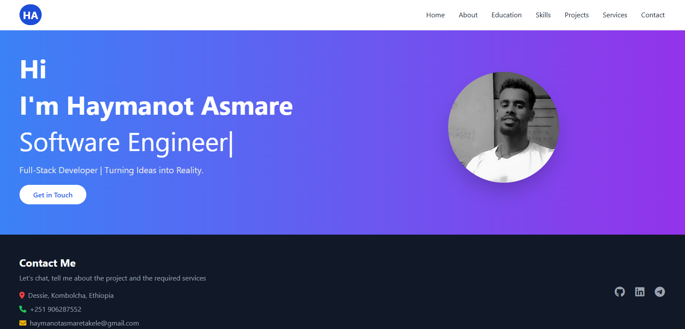
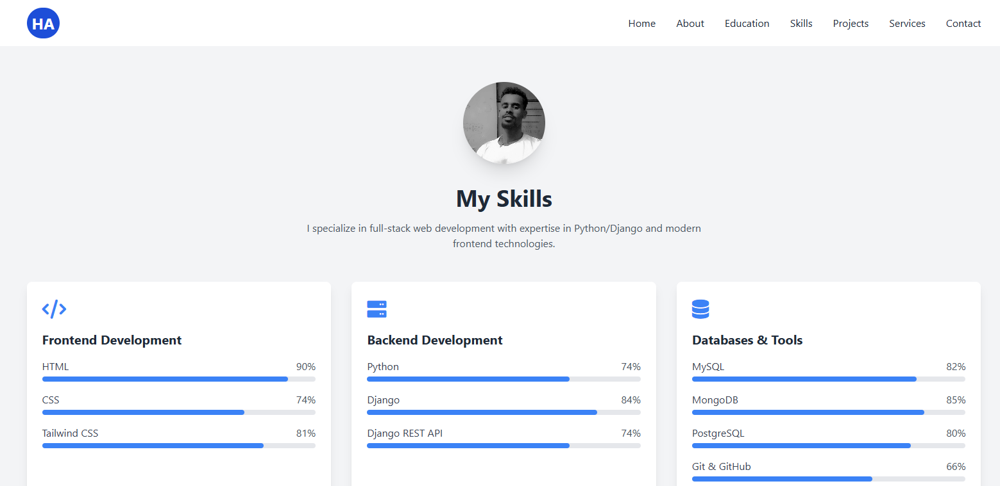

# 🌐 Haymanot's Personal Portfolio

Welcome to my personal portfolio — a fully responsive and modern web portfolio showcasing my background, skills, and work. Built with clean HTML, Tailwind CSS, JavaScript, and enhanced with animations and icons, this site provides an engaging experience and an organized way to present my journey as a developer.


---

## ✨ Live Preview

>  (https://haymanotportfolio.netlify.app)

---

## 🧰 Tech Stack

| Category             | Tools / Libraries Used                                                                 |
|----------------------|----------------------------------------------------------------------------------------|
| 🌐 Markup & Styling  | `HTML5`, `Tailwind CSS`                                                               |
| 🧠 Animations        | [AOS - Animate on Scroll](https://michalsnik.github.io/aos/)                          |
| 💡 Icons             | [Font Awesome 6](https://fontawesome.com/)                                            |
| ⚙️ Scripting         | `Vanilla JavaScript`                                                                  |
| 🧩 Components Loader | `load-components.js` for dynamically rendering navbar and footer across all pages     |

---

## 📁 Pages & Sections

### 🏠 Home
> Overview of who I am with a short introduction, welcome message, and navigation to the rest of the site.

### 👤 About
> A summary of my journey, values, and motivations as a developer.

### 🎓 Education
> My academic background and certifications presented in a visually clean timeline or list format.

### 💼 Skills
> Technical proficiencies with animated skill bars, including:

- **Frontend**: HTML, CSS, Tailwind CSS
- **Backend**: Python, Django, Django REST API
- **Databases & Tools**: MySQL, PostgreSQL, MongoDB, Git/GitHub
- **Professional Skills**: Agile, Problem Solving, Teamwork

### 🛠️ Services
> Key offerings like Web Development, API Integration, Backend Engineering, etc.

### 🚀 Projects
> Showcasing real-world applications and portfolio projects with links, tech stack, and descriptions.

### 📬 Contact
> Form or details to get in touch with me (email, social media, etc.)

---

## 📸 Screenshots

| Home Page | Skills Page |
|-----------|-------------|
|  |  |

---

## 🧠 Features

- 💻 **Responsive Layout** – Mobile-friendly and adaptive
- ✨ **Scroll Animations** – Smooth reveals on scroll using AOS
- 🔄 **Reusable Components** – Navbar and Footer rendered dynamically via JS
- 🎯 **Skill Bars** – Animated progress bars with real-time percentage rendering
- 🌈 **Minimalistic UI** – Clean, modern aesthetic powered by Tailwind CSS

---

## 🔧 Setup Instructions

```bash
# 1. Clone the repository
git clone https://github.com/practicmakesperfect/portfolio.git
cd portfolio

# 2. Open index.html or other pages directly in a browser
